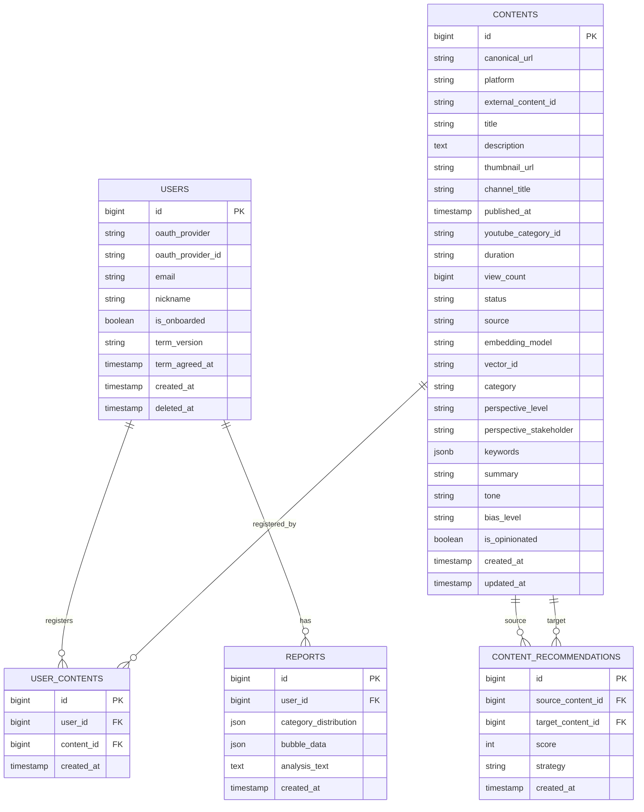

# mapin ERD

---

## 테이블 정의

### USERS

| 컬럼 | 타입 | 설명 |
| --- | --- | --- |
| id | bigint PK | 사용자 고유 ID |
| oauth_provider | string | OAuth 제공자 (google \| apple \| kakao) |
| oauth_provider_id | string | 제공자 측 사용자 ID |
| email | string | 이메일 |
| nickname | string | 닉네임 |
| is_onboarded | boolean | 온보딩 완료 여부 |
| term_version | string | 동의한 약관 버전 |
| term_agreed_at | timestamp | 약관 동의 일시 |
| created_at | timestamp | 가입 일시 |
| deleted_at | timestamp | 탈퇴 일시 (soft delete) |

### CONTENTS

| 컬럼 | 타입 | 설명 |
| --- | --- | --- |
| id | bigint PK | 콘텐츠 고유 ID |
| canonical_url | string | 정규화된 URL (unique) |
| platform | string | 플랫폼 (youtube 등) |
| external_content_id | string | 플랫폼 측 영상 ID |
| title | string | 콘텐츠 제목 |
| description | text | 콘텐츠 설명 |
| thumbnail_url | string | 썸네일 URL |
| channel_title | string | 채널명 |
| published_at | timestamp | 콘텐츠 게시 일시 |
| youtube_category_id | string | YouTube 카테고리 ID |
| duration | string | 영상 길이 |
| view_count | bigint | 조회수 |
| status | string | 파이프라인 상태 (PENDING \| ANALYZING \| DONE \| FAILED) |
| source | string | 유입 경로 (USER \| FALLBACK) |
| embedding_model | string | 임베딩에 사용된 모델명 (vector 전략 시) |
| vector_id | string | Qdrant 포인트 ID (vector 전략 시) |
| category | string | GPT 분류 카테고리 |
| perspective_level | string | 관점 깊이 (사건 \| 원인 \| 구조) |
| perspective_stakeholder | string | 관점 주체 (정부 \| 전문가 \| 시민 \| 기업 \| 국제) |
| keywords | jsonb | 핵심 키워드 목록 (fallback YouTube 검색에 활용) |
| summary | string | GPT 요약 (1~2문장) |
| tone | string | 논조 (중립 \| 비판적 \| 옹호 \| 경고 \| 분석) |
| bias_level | string | 편향 강도 (낮음 \| 중간 \| 높음) |
| is_opinionated | boolean | 의견·논평 여부 (사실보도=false) |
| created_at | timestamp | 생성 일시 |
| updated_at | timestamp | 수정 일시 |

### USER_CONTENTS

| 컬럼 | 타입 | 설명 |
| --- | --- | --- |
| id | bigint PK | |
| user_id | bigint FK | USERS.id |
| content_id | bigint FK | CONTENTS.id |
| created_at | timestamp | 등록 일시 |

### CONTENT_RECOMMENDATIONS

| 컬럼 | 타입 | 설명 |
| --- | --- | --- |
| id | bigint PK | |
| source_content_id | bigint FK | 추천 기준 콘텐츠 (CONTENTS.id) |
| target_content_id | bigint FK | 추천 대상 콘텐츠 (CONTENTS.id) |
| score | int | 반대관점 점수 (2: 강한 반대, 1: 약한 반대) |
| strategy | string | 사용된 추천 전략 (db \| vector) |
| created_at | timestamp | 생성 일시 |

### REPORTS

| 컬럼 | 타입 | 설명 |
| --- | --- | --- |
| id | bigint PK | |
| user_id | bigint FK | USERS.id |
| category_distribution | json | 카테고리 분포 스냅샷 |
| bubble_data | json | 버블 시각화용 스냅샷 |
| analysis_text | text | 분석 결과 텍스트 |
| created_at | timestamp | 생성 일시 |

---

## 변경 이력

### v1 → v2
- `ANALYSIS_RESULTS` 별도 테이블 제거 → `CONTENTS`에 분석 결과 컬럼 통합
  - 1:1 관계이므로 JOIN 불필요, 단순화
  - `raw_data json` 제거 → 개별 컬럼으로 분리 (쿼리/인덱스 가능)
- `CONTENTS` 신규 컬럼: `source`, `status`, `keywords`, `summary`, `tone`, `bias_level`, `is_opinionated`
- `CONTENT_RECOMMENDATIONS` 신규 테이블 추가 (반대관점 추천 관계 그래프)
